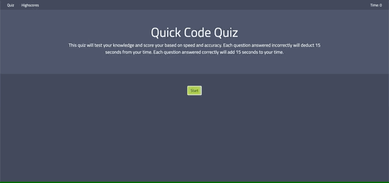

# coding_quiz

## Overview

 I created this quiz app to test my ability to dynamically generate and alter HTML elements with Javascript and JQuery. It tests users on their knowledge of a chosen topic, in this case web development. The questions are stored in an array on a seperate Javascript file from the main scripts.js. Any number of questions will work with the quiz provided that the user is able to get them correct without the time reaching 0. Speed and accuracy combine to create a score. That score is saved in local storage in another array and then dynamically placed on the highscores list to be viewed later. The clear scores button removes all previously entered scores for a fresh start.

### Gallery

## Tech and Features Used

| Feature       | Summary                                                                                                  | 
| ------------- | -------------------------------------------------------------------------------------------------------- |
| Bootstrap 4.0 | Used Bootstrap 4.0 to style quiz in a simple, responsive and appealing way.                              |
| Javascript    | Used Javascript to make the main index.html page responsive and dynamically update scores and questions. |
| JQuery        | Used JQuery to simply working with DOM and to quickly perform click events.                              |

## How to use

* Click the "Start" button to recieve the first question.
* Each correct answer will add 15 seconds to your total time.
* Each incorrect answer will subtract 15 seconds from your total time.
* When all questions have been answered or time reaches 0 the quiz will stop.
* Enter your name and click "Submit" to record your highscore.
* Highscores can be viewed at anytime by clicking "Highscores" in the nav bar.(Note: This will stop the quiz.)
* Highscores can be cleared by clicking the "Clear Highscores" button.
* To retry the quiz click "Quiz" in the nav bar.

## Known Bugs

* Final onscreen time may not be reflected in highscore if the last failed question results in a number less than 0.
* Clicking on Highscores page to view highscores without completing the quiz will result in "Name" and "Score" being popluated with "Undefined"

## Hosted

This site is hosted courtesy of github pages.

To view the site please click [here](https://meta-byte.github.io/coding_quiz).

## Contact Info

Email: hylander.garrett@gmail.com

Phone: (801)-592-0371

[Linkedin](https://www.linkedin.com/in/garrett-h-859007a0/)
